# 봉풀주 암?호 해독

[영상 링크](https://youtu.be/6ZKK9kLGOUU)

~~오잉? 영상 설명의 상태가...~~

## 1번


"ㅠㅁㄴㄷ64"를 한영 바꿔서 타이핑하면 "base64"

아래 자막을 [base64 decoder](https://www.base64decode.org/)에 넣고 복호화하면...

```text
해독 전: 6rOg7KCV66mk67KEIDDquLAg7Zmc64+Z7Iuc7KCIIOqzoOuppOydgCDsp4DsmKXsnbTri6Qo7IOB7LuoKSDstpzsl7Ag7ZmU66m0
해독 후: 고정멤버 0기 활동시절 고멤은 지옥이다(상컨) 출연 화면
```

## 2번

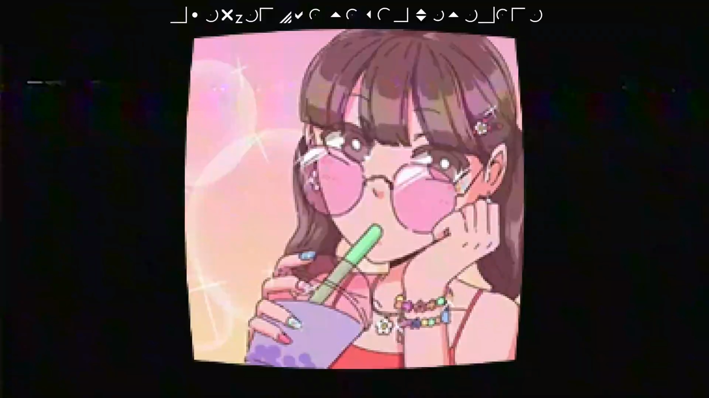

사진 위의 문?장은 Marlett이라는 폰트로 적힌 글인데,

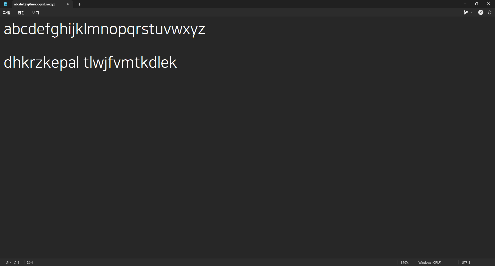

위 내용을 메모장의 편집 → 글꼴 메뉴에 들어가서 Marlett으로 바꿔보자

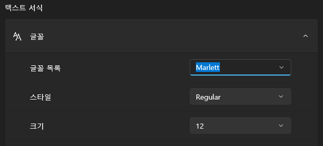
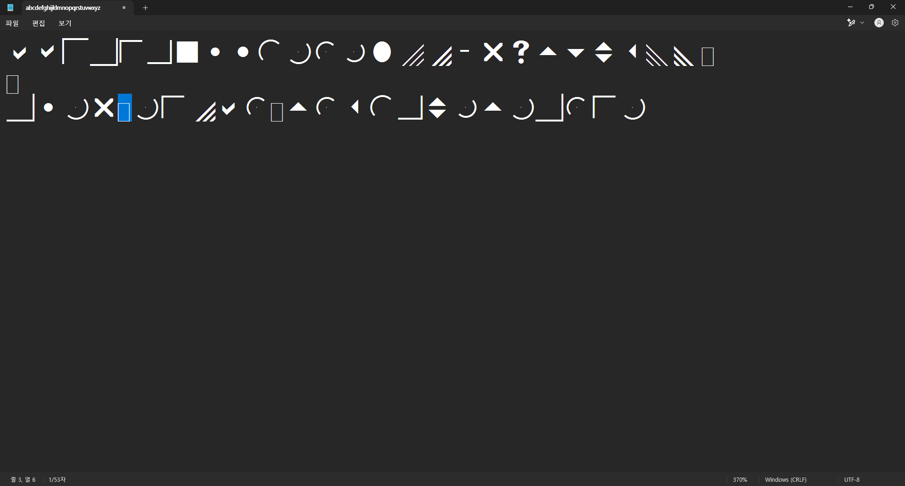

쨔잔! 원래 이미지와 다르게 'z'가 깨지는데 Marlett 폰트에 'z' 글리프가 없어서 그렇다.

해독된 문장을 한영 바꿔서 쳐보면...

```text
왁카데미 시절프사이다
```

## 3번

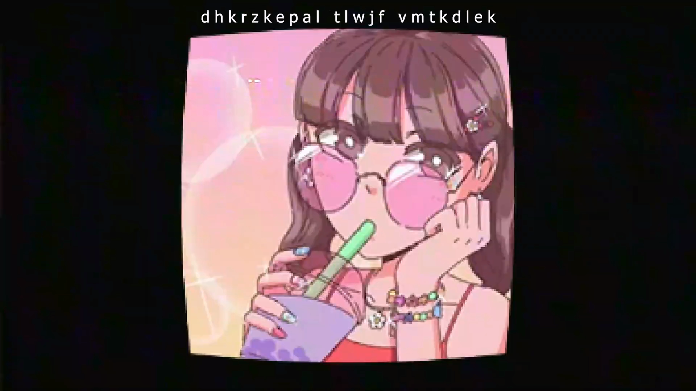

여기는 단순히 한영 바꿔서 치면 되니까 패스

```text
왁카데미 시절 프사이다
```

## 4번

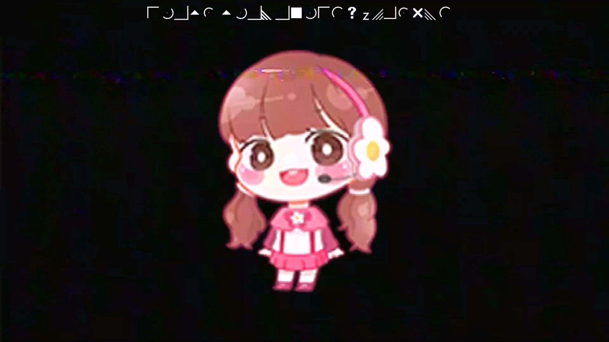

2번이랑 똑같다

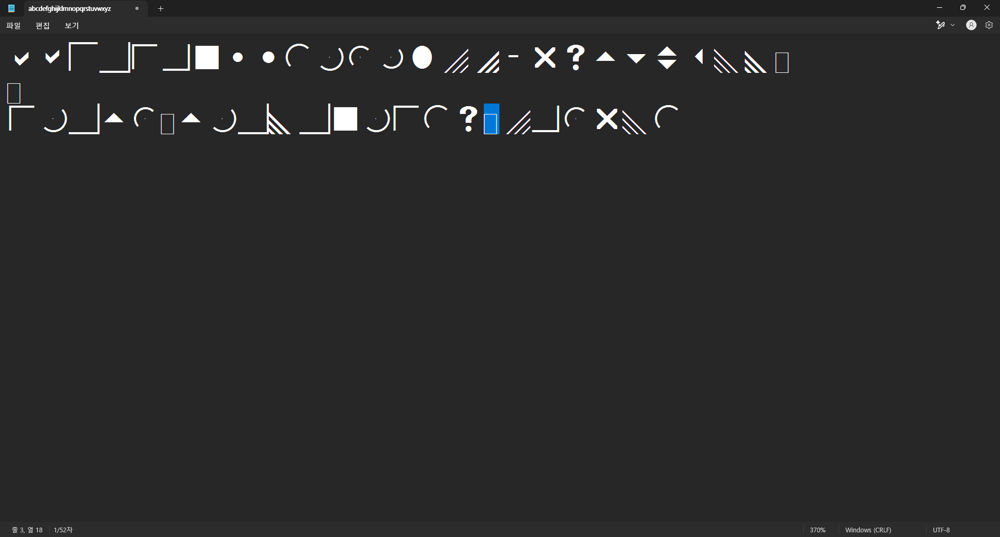
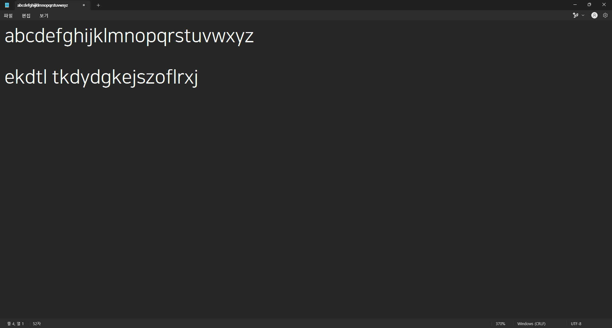

해독해보면,

```text
당시 사용하던캐릭터
```

## 5번

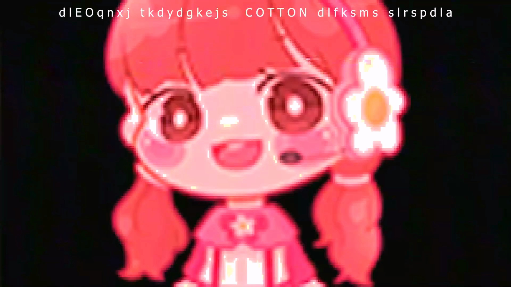

3번이랑 똑같다

```text
이떄부터 사용하던 COTTON 이라는 닉네임
```

'때'가 '떄'로 오타났다

## 6번

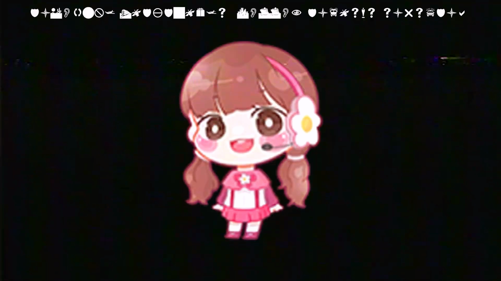

2, 4번이랑 비슷하면서도 다른데, 일단 메모장을 켜자.

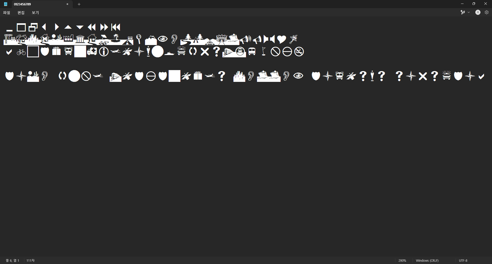

우와 정말 대단해~

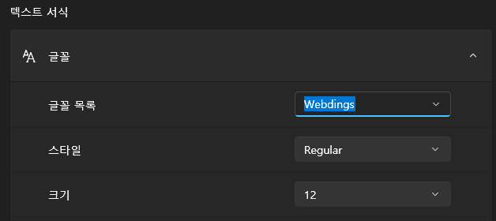
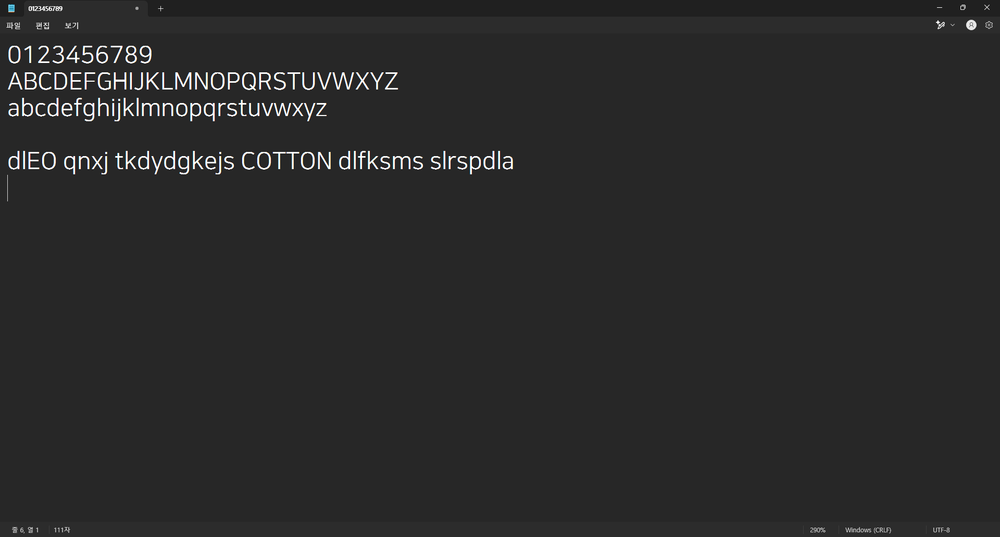

얘는 Webdings라는 폰트로 작성된 문장이었다!

마찬가지로 한영 바꿔서 쳐보면...

```text
이떄 부터 사용하던 COTTON 이라는 닉네임
```

5번이랑 '떄' 오타까지 똑같은 문장이 나왔다.

## 7번

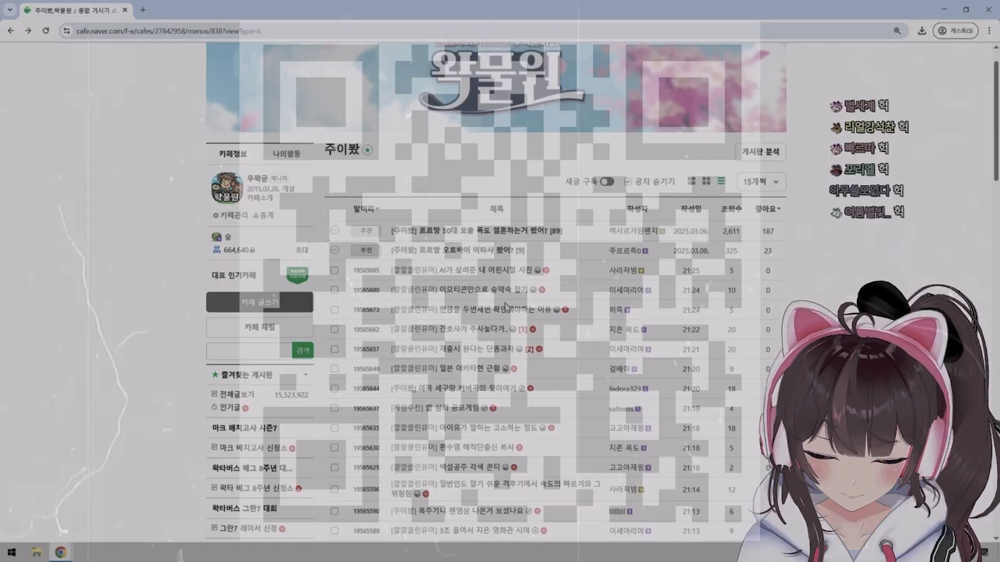

이 QR 코드는 명암을 조절하거나 직접 따라 그려서 찍어도 충분하지만,


왠지 위 이미지에서 아래 이미지를 빼서(?) QR 코드만 남겨보고 싶었다.

[소스 코드](7qr/main.py)

<details>
  <summary>
    결과 이미지(약간 기괴)
  </summary>

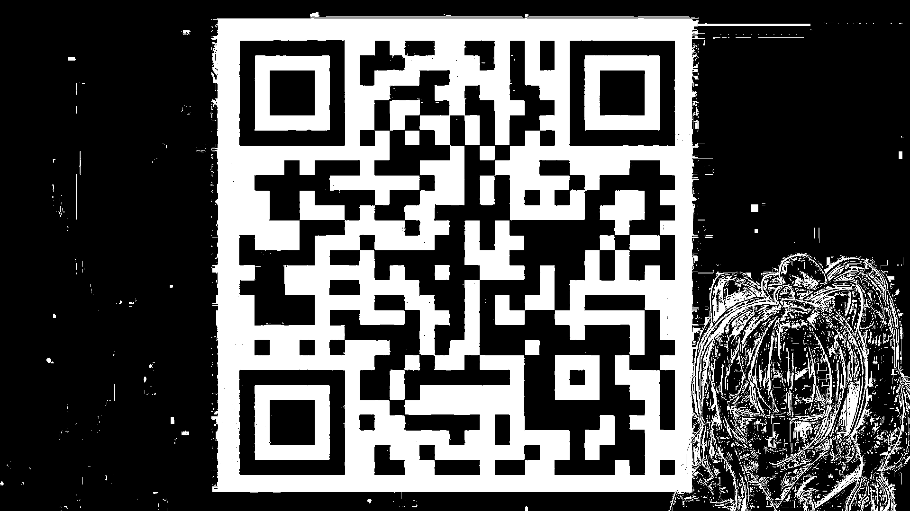

</details>

[QR 코드를 찍어보면... (얘도 약간 기괴)](https://qr.me-qr.com/data/image-pack/5wern7qh)

## -완-

못찾은거 있으면 알려주세요~
